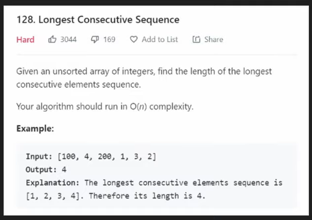

# Arrays & Hashing
 "Explore a curated collection of 9 array and hashing related problems, ranging from easy to medium difficulty. Enhance your algorithmic skills and understanding of data structures with this comprehensive repository."

## 0️⃣Table of Contents
1. [Contains Duplicate (Easy)](#contains-duplicate-easy)
2. [Valid Anagram (Easy)](#valid-anagram-easy)
3. [Two Sum (Easy)](#two-sum-easy)
4. [Group Anagrams (Medium)](#group-anagrams-medium)
5. [Top K Frequent Elements (Medium)](#top-k-frequent-elements-medium)
6. [Product of Array Except Self (Medium)](#product-of-array-except-self-medium)
7. [Valid Sudoku (Medium)](#valid-sudoku-medium)
8. [Encode and Decode Strings (Medium)](#encode-and-decode-strings-medium)
9. [Longest Consecutive Sequence (Medium)](#longest-consecutive-sequence-medium)

## Contains Duplicate (Easy)

## Valid Anagram (Easy)

## Two Sum (Easy)

## Group Anagrams (Medium)

## Top K Frequent Elements (Medium)

## Product of Array Except Self (Medium)

## Valid Sudoku (Medium)

## Longest Consecutive Sequence (Medium)

